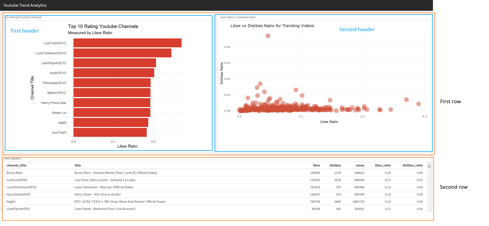
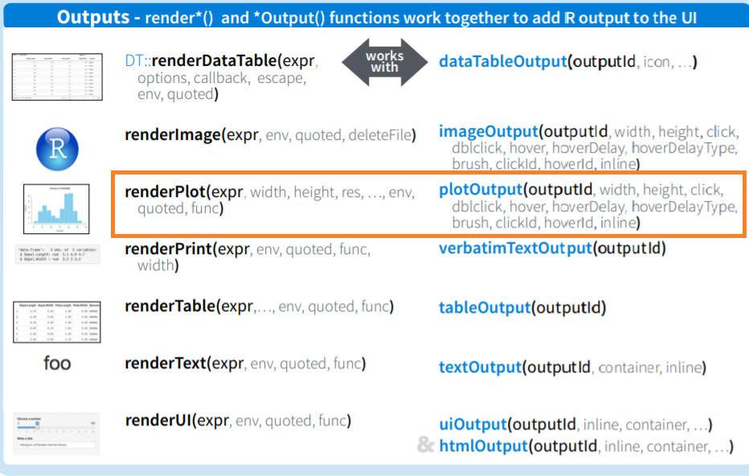

```{r setup, include=FALSE}
knitr::opts_chunk$set(
  echo = TRUE,
  warning = FALSE,
  error = TRUE,
  message = FALSE,
  fig.align = "center"
)
rm(list = ls())
options(scipen = 9999)
```
## R Markdown

'*********************************
Problem 1
```{r}
library(dplyr)
yt = read.csv("youtube.csv")

yt %>% 
  filter(category_id == "Music") %>% 
  group_by(channel_title) %>% 
  summarise(likes_ratio = mean(likes/views)) %>% 
  arrange(desc(likes_ratio)) %>% 
  head(10)
```
From the result, we can see the most liked videos in terms of ratio figures as expected. Therefore, we can conclude that all the functions that work are: filter(), summarise() and arrange()

'*********************************
Problem 2
```{r}

```
From the picture above we can conclude that the dashboard layout is designed as follows:

Orientation: rows
2 headers in first section
1 header in the second section


'*********************************
Problem 3
The top-right plot shows the likes ratio and dislikes ratio across trending videos within the Music category. To add a shiny interactivity feature where users could pick their desired category and the plot would change accordingly, we can use 

selectInput

Among other options, this is the one that makes the most sense because we are working with categorical data that is not numeric or range of continuous numbers. We know that sliders work best for dealing with such value type.


'*********************************
Problem 4
If we want to have a top right plot to be able to display each video title for further analysis, instead of using geom_text, we can render a plot object displaying each video title for each hover action by using this statement pair that appears in the UI Dashboard and its server section

output$plot1 <- renderPlotly({}) ; plotlyOutput("plot1")

Referring to Shiny's cheat sheet, we can easily find that the renderPlot() function is paired with the plotOutput() function; similarly, for interactive mode, we know that the function pairs are renderPlotly() and plotlyOutput()

```{r}

```

